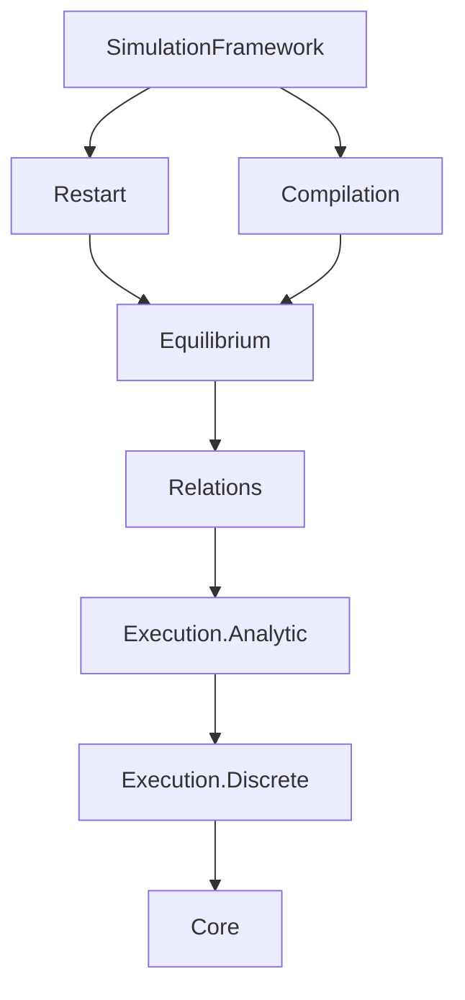
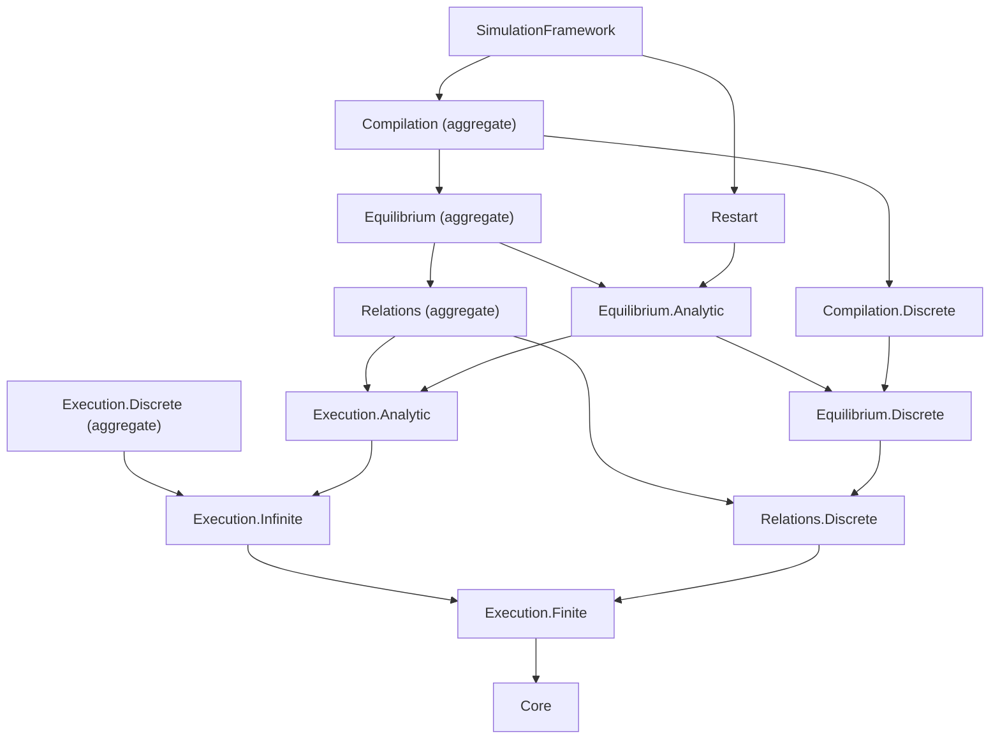

# EFG Import Granularity Audit

This note records the dependency split between finite/PMF EFG semantics and
measure-valued analytic semantics. It complements
[`efg-public-api.md`](efg-public-api.md); source imports remain authoritative.

## Audit method

The counts below were computed from the transitive source import graph on
2026-07-29 and rechecked after the 2026-07-30 physical-layout closeout. “EFG”
counts modules below
`EconCSLib.GameTheory.ExtensiveGame`; “local” counts all `EconCSLib` modules.
The imported facade itself is excluded.

The no-analysis entries were also checked in two independent ways:

- their local closure contains no `MeasurableKernel*`, `PMF.ToMeasure`,
  `Execution.InfiniteTrajectory`, or `Observed.InfiniteExecution` module and
  no local module that directly imports `Mathlib.Probability.Kernel.*` or
  `Mathlib.MeasureTheory.*`;
- compile-time negative guards show that `ProbabilityTheory.Kernel`,
  `MeasurableKernelArena`, and `Arena.pathLaw` are not name-resolvable.

PMF primitives still use Mathlib's probability-mass-function library. “No
analysis” here means that the EFG public entry does not import the
measure-valued path, Markov-kernel, integration, or non-atomic execution
layers; it does not claim that Mathlib internally implements PMFs without any
shared foundational files.

## Import DAG before the split

Only facade-to-facade edges are shown:

This graph had two granularity defects:

1. `Execution.Discrete` imported `Execution.InfiniteTrajectory`, whose genuine
   infinite path law is constructed with Ionescu--Tulcea kernels and
   MeasureTheory.
2. `Relations` inherited all of `Execution.Analytic`; `Equilibrium` and
   `Compilation` then inherited it even when a client used only strict
   structure, bounded PMF laws, finite Kuhn, or a finite compiler.

## Import DAG after the split

Solid granular nodes are the recommended entries. Nodes ending in
“aggregate” retain the old import paths and closures for compatibility.

There is no reverse analytic-to-discrete edge and no cycle. Analytic
execution reuses both finite and infinite discrete execution; analytic
equilibrium explicitly reuses discrete equilibrium. Restart is intrinsically
analytic. The complete `Compilation` aggregate remains analytic-compatible,
while `Compilation.Discrete` contains the finite/PMF compilers and serializers.

No `Relations.Analytic` module was added: the audit found no relation-specific
declaration whose implementation needs the analytic execution stack. The old
`Relations` module is exactly the useful analytic superset. Adding another
name would create directory symmetry without reducing a dependency.

## Declaration classification

The table classifies declaration families by the module that defines them,
not by every name that becomes transitively visible.

| Surface | Class | Defining modules and representative declarations |
|---|---|---|
| Relations | pure structural | `Relations.Discrete.Morphism`: `Arena.Hom`, `Arena.Iso`, `Arena.Simulation`, `Arena.Bisimulation`, `Arena.WeakSimulation`; `Observed.Morphism.{Fiber,Structural,Inverse,Operational}`: `ObservedGame.Iso` and exact history/payoff transport; `Observed.Refinement.Structural`: `ObservedGame.InformationRefinement` |
| Relations | PMF/discrete | `KernelArena`: `KernelArena.Hom`, `KernelArena.Simulation`; `KernelTrajectory`: `Policy`, `stateLawFrom`, `traceLawFrom`, `Simulation.PolicyMatch`; `KernelWeakSimulation`: `ProbabilisticWeakSimulation`, `supportArena`, `executionKernelArena`; `Observed.Chance`, `Observed.Behavior`, and `BehaviorRefinement.Structural`: chance kernels, behavioral PMFs, and chance-aware information refinement |
| Relations | Kernel/Measure | no relation declaration; the old facade exposed this class only by inheriting `Execution.Analytic` |
| Equilibrium | pure deterministic/structural | `Observed.SPE`, `Observed.Morphism.Continuation`, `Observed.Refinement.{Core,Termination}`, `Observed.MorphismHierarchy`, and `Observed.PerfectRecall`: pure Nash/SPE, lawful-root transport, termination-certified transfer, and recall structure |
| Equilibrium | PMF/discrete | `Observed.BehaviorMorphism`, `BehaviorRefinement.Execution`, `Realization`, `Mixed`, `Continuation`, `Kuhn`, `DeferredSampling`, `KuhnConditioning`, and `StrategyBridge`: bounded behavioral/mixed Nash, law realization, finite Kuhn, PMF conditioning, and uniform transfer adapters |
| Equilibrium | Kernel/Measure | `Simulation.Equilibrium.Outcome`: measurable/integrable path utility and constructive Nash; `Simulation.Continuation.Observed`: absolute-prefix/fresh-clock path laws and continuation equilibrium; `Simulation.Continuation.ObservedConditioning`: regular conditional continuation compatibility |

Pure and PMF equilibrium were deliberately kept together in
`Equilibrium.Discrete`. They share the observed behavioral, realization, and
Kuhn implementation chain, and neither imports the analytic layer. Splitting
them again would add navigation cost without addressing the measured
dependency problem.

## Dependency comparison

| Use case | Former entry and closure | Recommended entry and closure | Reduction |
|---|---:|---:|---:|
| finite deterministic/PMF execution | `Execution.Discrete`, 17 / 32 | `Execution.Finite`, 15 / 30 | 2 EFG / 2 local; analytic roots 5 → 0 |
| strict structure, PMF coupling, weak simulation | `Relations`, 41 / 57 | `Relations.Discrete`, 21 / 36 | 20 EFG / 21 local |
| pure/behavioral/mixed finite-fuel equilibrium and Kuhn | `Equilibrium`, 72 / 92 | `Equilibrium.Discrete`, 47 / 66 | 25 EFG / 26 local |
| finite observed-EFG compilers and FOSG serialization | `Compilation`, 94 / 116 | `Compilation.Discrete`, 69 / 90 | 25 EFG / 26 local |

The compatibility wrappers add only facade modules to the old closures:

| Current compatibility/analytic entry | EFG / local closure |
|---|---:|
| `Execution.Infinite` | 18 / 33 |
| `Execution.Discrete` | 19 / 34 |
| `Execution.Analytic` | 37 / 53 |
| `Relations` | 43 / 59 |
| `Equilibrium.Analytic` | 74 / 94 |
| `Equilibrium` | 76 / 96 |
| `Restart` | 82 / 102 |
| `Compilation` | 99 / 121 |
| `SimulationFramework` | 108 / 131 |

The increases relative to the former broad closures are the new facade files,
not duplicated mathematical declarations.

## Downstream imports and build targets

| Client need | Import/build target |
|---|---|
| bounded deterministic, observed behavioral, or PMF-kernel execution | `EconCSLib.GameTheory.ExtensiveGame.Interface.Execution.Finite` |
| measure-valued infinite paths generated by discrete PMF policies | `EconCSLib.GameTheory.ExtensiveGame.Interface.Execution.Infinite` |
| strict structural, information-refinement, PMF-coupling, or weak-simulation results | `EconCSLib.GameTheory.ExtensiveGame.Interface.Relations.Discrete` |
| pure, behavioral, mixed, finite Kuhn, or termination-certified equilibrium | `EconCSLib.GameTheory.ExtensiveGame.Interface.Equilibrium.Discrete` |
| measurable-kernel path utility, continuation, and conditioning | `EconCSLib.GameTheory.ExtensiveGame.Interface.Equilibrium.Analytic` |
| finite compilers and PMF FOSG serialization | `EconCSLib.GameTheory.ExtensiveGame.Interface.Compilation.Discrete` |
| old complete relation/equilibrium/compiler closure | unchanged `Interface.Relations`, `Interface.Equilibrium`, or `Interface.Compilation` |

The granular paths are facade-only changes: declarations remain in their
original implementation modules, so theorem names, namespaces, and record
fields are unchanged.
