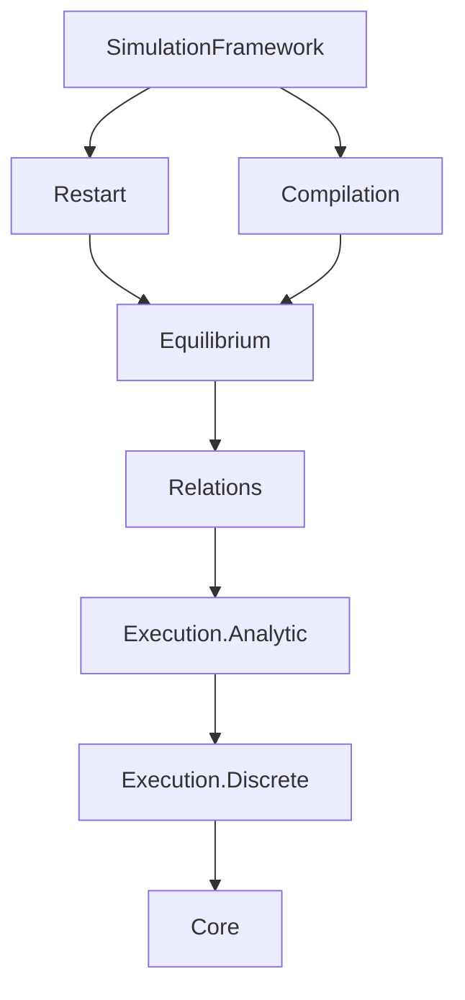
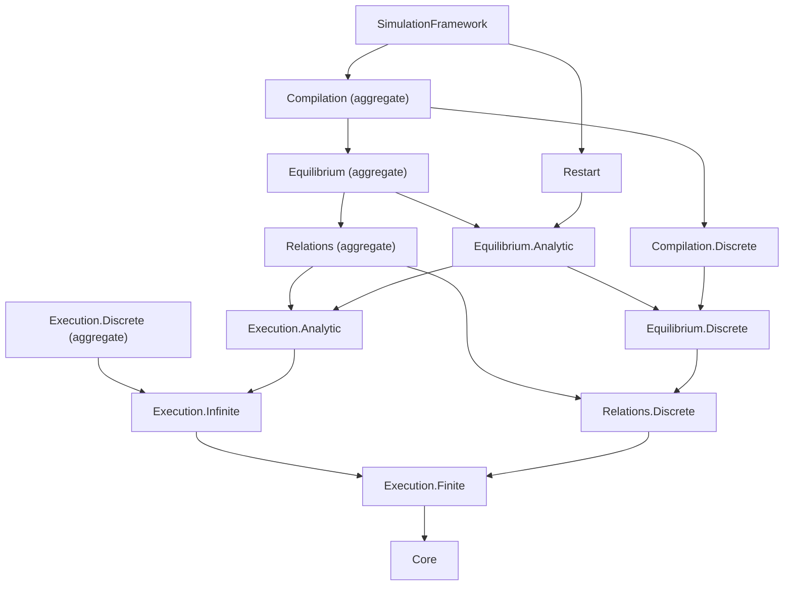

# EFG Import Granularity Audit

This note records the dependency split between finite/PMF EFG semantics and
measure-valued analytic semantics. It complements
[`efg-public-api.md`](efg-public-api.md); source imports remain authoritative.

## Audit method

The counts below were computed from the transitive source import graph and
rechecked after the 2026-08-03 preservation-facade audit. “EFG”
counts modules below
`EconCSLib.GameTheory.ExtensiveGame`; “local” counts all `EconCSLib` modules.
The imported facade itself is excluded.

The no-analysis entries were also checked in two independent ways:

- their local closure contains no `MeasurableKernel*`, `PMF.ToMeasure`,
  `Execution.InfiniteTrajectory`, or `Observed.InfiniteExecution` module and
  no local module that directly imports `Mathlib.Probability.Kernel.*` or
  `Mathlib.MeasureTheory.*`;
- compile-time negative guards show that `ProbabilityTheory.Kernel`,
  `MeasurableKernelArena`, and `Arena.pathLaw` are not name-resolvable.

PMF primitives still use Mathlib's probability-mass-function library. “No
analysis” here means that the EFG public entry does not import the
measure-valued path, Markov-kernel, integration, or non-atomic execution
layers; it does not claim that Mathlib internally implements PMFs without any
shared foundational files.

## Import DAG before the split

Only facade-to-facade edges are shown:

This graph had two granularity defects:

1. `Execution.Discrete` imported `Execution.InfiniteTrajectory`, whose genuine
   infinite path law is constructed with Ionescu--Tulcea kernels and
   MeasureTheory.
2. `Relations` inherited all of `Execution.Analytic`; `Equilibrium` and
   `Compilation` then inherited it even when a client used only strict
   structure, bounded PMF laws, finite Kuhn, or a finite compiler.

## Import DAG after the split

Solid granular nodes are the recommended entries. Nodes ending in
“aggregate” are retained in this historical diagram only to explain the
migration; their source paths were subsequently hard-deleted during
pre-stability.

There is no reverse analytic-to-discrete edge and no cycle. Analytic
execution reuses both finite and infinite discrete execution; analytic
equilibrium explicitly reuses discrete equilibrium. Restart is intrinsically
analytic. The deleted `Compilation` aggregate was analytic-compatible, while
`Compilation.Discrete` contains the finite/PMF compilers and serializers.

No `Relations.Analytic` module was added: the audit found no relation-specific
declaration whose implementation needs the analytic execution stack.
`Interface.Preservation` instead exposes the independent
preservation-strength vocabulary, including measure-valued path-law
realization and coupling, without importing the non-atomic executor. Adding
an empty analytic-relations name would create directory symmetry without
reducing a dependency.

## Declaration classification

The table classifies declaration families by the module that defines them,
not by every name that becomes transitively visible.

| Surface | Class | Defining modules and representative declarations |
|---|---|---|
| Relations | pure structural | `Relations.Discrete.Morphism`: `Arena.Hom`, `Arena.Iso`, `Arena.Simulation`, `Arena.Bisimulation`, `Arena.WeakSimulation`; `Observed.Controlled.Morphism.{Core,Subgame,Recall}`: payoff-free `Hom`, `Iso`, information refinement, and separately layered subgame/recall transport; `Observed.Morphism.{Fiber,Structural,Inverse,Operational}`: `ObservedGame.Iso` and exact history/payoff transport; `Observed.Refinement.Structural`: `ObservedGame.InformationRefinement` |
| Relations | PMF/discrete | `KernelArena`: `KernelArena.Hom`, `KernelArena.Simulation`; `KernelTrajectory`: `Policy`, `stateLawFrom`, `traceLawFrom`, `Simulation.PolicyMatch`; `KernelWeakSimulation`: `ProbabilisticWeakSimulation`, `supportArena`, `executionKernelArena`; `Observed.Chance`, `Observed.Behavior`, and `BehaviorRefinement.Structural`: chance kernels, behavioral PMFs, and chance-aware information refinement |
| Preservation | Kernel/Measure | `Relations.Preservation`: complete-path realizations, probability couplings, and strict/weak compiler packages; coupling remains distinct from equality or isomorphism |
| Equilibrium | pure deterministic/structural | `Observed.SPE`, `Observed.Morphism.Continuation`, `Observed.Refinement.{Core,Termination}`, `Observed.MorphismHierarchy`, and `Observed.PerfectRecall`: pure Nash/SPE, lawful-root transport, termination-certified transfer, and recall structure |
| Equilibrium | PMF/discrete | `Observed.BehaviorMorphism`, `BehaviorRefinement.Execution`, `Realization`, `Mixed`, `Continuation`, `Kuhn`, `DeferredSampling`, `KuhnConditioning`, and `StrategyBridge`: bounded behavioral/mixed Nash, law realization, finite Kuhn, PMF conditioning, and uniform transfer adapters |
| Equilibrium | Kernel/Measure | `Simulation.Equilibrium.Outcome`: measurable/integrable path utility and constructive Nash; `Simulation.Continuation.Observed`: absolute-prefix/fresh-clock path laws and continuation equilibrium; `Simulation.Continuation.ObservedConditioning`: regular conditional continuation compatibility |

Pure and PMF equilibrium were deliberately kept together in
`Equilibrium.Discrete`. They share the observed behavioral, realization, and
Kuhn implementation chain, and neither imports the analytic layer. Splitting
them again would add navigation cost without addressing the measured
dependency problem.

## Dependency comparison

| Use case | Former entry and closure | Recommended entry and closure | Reduction |
|---|---:|---:|---:|
| finite deterministic/PMF execution | `Execution.Discrete`, 42 / 49 | `Execution.Finite`, 36 / 43 | 6 EFG / 6 local |
| strict structure, PMF coupling, weak simulation | `Relations`, 71 / 79 | `Relations.Discrete`, 42 / 49 | 29 EFG / 30 local |
| pure/behavioral/mixed/general finite-fuel semantics and Kuhn | `Equilibrium`, 104 / 121 | `Equilibrium.Discrete`, 69 / 85 | 35 EFG / 36 local |
| finite observed-EFG compilers and FOSG serialization | `Compilation`, 126 / 145 | `Compilation.Discrete`, 90 / 108 | 36 EFG / 37 local |

For historical comparison, the deleted compatibility wrappers added only
facade modules to the old closures:

| Historical compatibility/analytic entry | EFG / local closure |
|---|---:|
| `Execution.Infinite` | 41 / 48 |
| `Execution.Discrete` | 42 / 49 |
| `Execution.Analytic` | 61 / 69 |
| `Relations` | 71 / 79 |
| `Equilibrium.Analytic` | 99 / 116 |
| `Equilibrium` | 104 / 121 |
| `Restart` | 107 / 124 |
| `Compilation` | 126 / 145 |
| `SimulationFramework` | 135 / 155 |

The current standalone `Interface.Preservation` closure is 23 / 28 when the
facade itself is counted (22 / 27 when excluded, as in
`efg-public-api.md`).

The current counts include the minimal `Controlled.Infrastructure.WellFormed`
owner and three `Controlled.Morphism` declaration leaves. This changes
physical module counting, not mathematical ownership cardinality: every
declaration has one definition. In return, Recall no longer inherits
finite/length execution, and clients needing only structural controlled
morphisms can use a 9 / 9 closure rather than the 15 / 15 aggregate facade.
The earlier infrastructure split also removed the former
Core-to-Winning/Objective import edge.

The two foundation entries are now measured separately:

| Foundation entry | EFG / local closure | Boundary |
|---|---:|---|
| `Interface.StructuralCore` | 5 / 5 | exact Arena/reachability/history/complete-play/controlled-observation closure |
| `Interface.Core` | 17 / 17 | broader Foundation Facade with structural owners plus payoff-aware adapters needed by bounded endpoint-payoff execution, length, bounded deterministic/PMF execution, general well-formedness, subgame, finite, quasistrategy, and recall leaves |

## Downstream imports and build targets

| Client need | Import/build target |
|---|---|
| only Arena dynamics, reachability, histories, complete plays, payoff-free observed control, root presentations, and pure strategies | `EconCSLib.GameTheory.ExtensiveGame.Interface.StructuralCore` |
| foundation certificates or bounded deterministic/PMF execution | `EconCSLib.GameTheory.ExtensiveGame.Interface.Core` |
| measure-free complete plays, structural termination, or terminal/path outcomes | `EconCSLib.GameTheory.ExtensiveGame.Interface.Objective` |
| bounded deterministic, observed behavioral, or PMF-kernel execution | `EconCSLib.GameTheory.ExtensiveGame.Interface.Execution.Finite` |
| measure-valued infinite paths generated by discrete PMF policies | `EconCSLib.GameTheory.ExtensiveGame.Interface.Execution.Infinite` |
| strict structural, information-refinement, PMF-coupling, or weak-simulation results | `EconCSLib.GameTheory.ExtensiveGame.Interface.Relations.Discrete` |
| preservation-strength aliases, complete-path realizations, probability couplings, or compiler packages | `EconCSLib.GameTheory.ExtensiveGame.Interface.Preservation` |
| pure, behavioral, mixed, finite Kuhn, or termination-certified equilibrium | `EconCSLib.GameTheory.ExtensiveGame.Interface.Equilibrium.Discrete` |
| measurable-kernel path utility, continuation, and conditioning | `EconCSLib.GameTheory.ExtensiveGame.Interface.Equilibrium.Analytic` |
| finite compilers and PMF FOSG serialization | `EconCSLib.GameTheory.ExtensiveGame.Interface.Compilation.Discrete` |
| multiple relation/equilibrium/compiler tiers | import the required granular facades explicitly |

The granular paths are the recommended pre-stability migration boundary, not
a current external source-compatibility guarantee. Former broad paths were
hard-deleted during pre-stability. The 2026-08-01
refactor also moved payoff-aware projections into explicit adapter modules;
the canonical payoff-free owners are listed in the module register.
